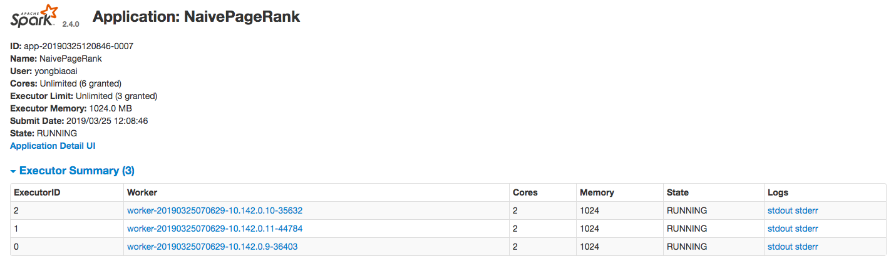
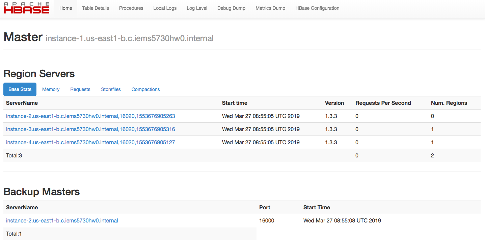

## Q1: Spark Basic RDD

Install Commands

```bash
sudo apt-get install scala
wget http://ftp.cuhk.edu.hk/pub/packages/apache.org/spark/spark-2.4.0/spark-2.4.0-bin-hadoop2.7.tgz
tar xvf spark-2.4.0-bin-hadoop2.7.tgz

vim ~/.bashrc
# Add following configuration
#export SPARK_HOME=/home/yongbiaoai/pkgs/spark-2.4.0-bin-hadoop2.7
#export PATH=$SPARK_HOME/bin:$PATH

vim ./conf/spark-env.sh
#export SPARK_MASTER_HOST=instance-1
#export SPARK_WORKER_MEMORY=1g

touch slaves
vim slaves
#instance-2
#instance-3
#instance-4

# copy files to other instances
for i in {2,3,4}; do scp -r ./spark-2.4.0-bin-hadoop2.7 instance-$i:~/pkgs; done

# start master and slaves
start-all.sh

# visit website pages
# http://instance-1:8080/

# add data into hdfs
hadoop dfs -copyFromLocal web-Google.txt hw4/
```

### a. Naive implementation of PageRank in Spark.

Commands:

```bash
# install sbt for compile
echo "deb https://dl.bintray.com/sbt/debian /" | sudo tee -a /etc/apt/sources.list.d/sbt.list
sudo apt-key adv --keyserver hkp://keyserver.ubuntu.com:80 --recv 642AC823
sudo apt-get update
sudo apt-get install sbt

# build the jar
sbt compile
sbt package

# submit spark job
spark-submit --class q1_basic.NaivePageRank \
  target/scala-2.11/iems5730_hw4_2.11-0.1.jar \
  NaivePageRank \
  spark://instance-1:7077 \
  hdfs://instance-1:9000/user/yongbiaoai/hw4/web-Google.txt
```

Spark UI:



Top 100 Results:

```text
41909	393.8959464232638
504140	372.30447571496086
597621	364.7006060893363
384666	358.05012987449
486980	349.00263590067857
537039	340.7445929678043
751384	338.3541510083052
32163	336.32594970370957
765334	328.5825741203172
605856	328.08400994763014
163075	317.09268977018826
425770	308.4254280440594
558791	307.374947802058
173976	305.1501551246516
908351	295.4081117495541
459074	277.96925647355107
905628	276.15190768754104
687325	266.2303532314563
452291	263.5648281522239
396321	263.27016933870425
172133	263.09640235900446
226374	259.86957488294377
551829	259.2149291996056
407610	258.30470737177643
828963	255.60702541196335
885605	244.22305180866715
7314	239.61123777504972
691633	236.1912672394007
182121	233.9991318408428
726490	231.28289283586588
213432	228.41314269943481
804489	227.17401903022684
324502	224.95344742116558
721816	221.53670631447943
245186	215.30109519151992
185067	214.1876382613955
402132	212.57378262906843
54147	209.22012395091292
599130	208.962154743528
277876	208.01344606988695
185821	207.97277489096254
587935	203.8756933475415
399699	202.2367828273542
621670	200.8010817536305
448961	196.57693530872695
57791	194.53404309528696
191990	194.01689557436742
555924	192.28145809349087
870811	190.25115264043615
434134	188.20489167091196
699754	187.06496112725262
614831	183.7224965968487
715883	181.48673013223777
468736	181.1004055724905
323129	180.667118328923
486434	178.181181604453
818382	174.13678228923004
596972	171.76726831553285
626893	171.3268603557503
354640	167.9670255525559
846221	167.65144989647675
74397	161.33079865486812
637936	160.13840901259326
183501	160.0999189830742
1536	159.6517923754891
557124	158.61938620924
587721	157.46614909147925
223236	157.19090560847565
466323	155.4289508833344
819223	154.88822165037453
666882	154.37337690629738
483532	153.75700749493348
21682	153.39165290685725
138746	150.0718204475704
227675	147.98189625283175
812640	145.75532902121176
772466	144.7618919589404
369102	142.58211180084294
438493	141.5659151126303
187242	139.24505776995667
427629	137.55464654636546
495084	136.8439951392235
798584	136.36107132698825
298511	135.85761693812904
522190	135.73898794417448
133962	132.01955587844625
704396	127.71712963562084
48888	126.48184881949182
36292	122.57957880928734
887710	121.28625909702188
564521	121.20301040187945
438491	120.80140447883166
655158	118.64816146995305
673065	117.41479817836097
539241	116.36172588127297
352975	116.09707466455852
456932	114.33232478904563
556129	112.88118417678413
568104	112.86965980756096
762917	109.60354308767525

Total time cost=505s
```

### b. Advanced implementation of PageRank in Spark.

```bash
sbt compile
sbt package

# submit spark job
spark-submit --class q1_basic.AdvancedPageRank \
target/scala-2.11/iems5730_hw4_2.11-0.1.jar \
AdvancedPageRank \
spark://instance-1:7077 \
hdfs://instance-1:9000/user/yongbiaoai/hw4/web-Google.txt \
12
```

|No.|Num of Partitions|Time Cost|
|---|---|---|
|1|1|751s|
|2|3|463s|
|3|6|332s|
|4|9|301s|
|5|12|284s|
|6|24|299s|
|7|36|301s|
|8|72|337s|

Explains:

* When the number of partitions keep increasing from **1 to 12**, the job execution time cost will **keep decreasing from 751s to 284s**, this is the `HashPartitioner` given in RDD are able to avoid extra shuffle overhead in the cluster. Therefore, the execution time will keep decrease.
* When the number of partitions keep increasing from **12 to 72**, the job execution time cost will **keep increasing from 284s to 337s** rather than decreasing. This is because larger partitions number given to the Spark will cause higher cost on the task scheduling rather than the acutal job execution. Therefore, the execution time will increase when the number is too large.
* In the Question a, the program will cost 505s when the `HashPartitioner` was not given, however, when I **given the number of partitions to 1**, the time will cost 751s, which is much higher than 505s. This is because when the number of partitions only set to 1, there program will suffer the suffle program, and the Spark framework will cost extra time on task scheduleing, which is much worse.

## Q2: Spark SQL

### a. Use Spark to truncate the file and only keep these 6 items of each line of record.

Commands:

```bash
# copy to hdfs
hadoop dfs -copyFromLocal Crime_Incidents_in_2013.csv hw4

sbt compile
sbt package

# submit job
spark-submit --class q2_sql.CrimeIncidents \
target/scala-2.11/iems5730_hw4_2.11-0.1.jar \
CrimeIncidents \
spark://instance-1:7077 \
hdfs://instance-1:9000/user/yongbiaoai/hw4/
```

Code:

```scala
// a. Use Spark to truncate the file and only keep these 6 items of each line of record.
val crimesDF = spark.read.format("csv")
  .option("inferSchema", "true")
  .option("header", "true")
  .load(filePath + "Crime_Incidents_in_2013.csv")

val selectedColumn = crimesDF.select("CCN", "REPORT_DAT", "OFFENSE", "METHOD", "END_DATE", "DISTRICT")
selectedColumn.printSchema()
```

Results:

```text
root
 |-- CCN: integer (nullable = true)
 |-- REPORT_DAT: timestamp (nullable = true)
 |-- OFFENSE: string (nullable = true)
 |-- METHOD: string (nullable = true)
 |-- END_DATE: timestamp (nullable = true)
 |-- DISTRICT: integer (nullable = true)
```

### b. Use Spark queries to count the number of each type offenses.

Code:

```scala
// b. Use Spark queries to count the number of each type offenses.
println("Question B\n")
println("Count the number of each type offenses:")
selectedColumn.groupBy("OFFENSE").count()
  .orderBy(desc("count"))
  .collect().foreach(r => println(r.mkString("\t")))

println("\nWhich time-slot (shift) did the most crimes occur:")
val offencesDF = crimesDF.select("CCN", "REPORT_DAT", "SHIFT", "OFFENSE", "METHOD", "END_DATE", "DISTRICT")
offencesDF.groupBy("SHIFT").count()
  .orderBy(desc("count"))
  .take(1).foreach(r => println(r.mkString("\t")))
```

Results:

Count the number of each type offenses:

```text
THEFT/OTHER	12855
THEFT F/AUTO	10171
ROBBERY	3985
BURGLARY	3355
MOTOR VEHICLE THEFT	2665
ASSAULT W/DANGEROUS WEAPON	2392
SEX ABUSE	299
HOMICIDE	104
ARSON	35
```

Which time-slot (shift) did the most crimes occur:

```text
EVENING	15039
```

**EVENING** SHITFT have the largest cirmes occur count, which is 15039.

For each crime methods, the most shift occur:

Code:

```scala
val firstGroup = offencesDF.groupBy("OFFENSE", "SHIFT").count().alias("count")
val secondGroup = firstGroup.groupBy("OFFENSE").agg(max("count").alias("max"))
	.orderBy(desc("max"))
val joinedResult = firstGroup.join(secondGroup, "OFFENSE")
  .where("max == count")
  .select("OFFENSE", "SHIFT", "count")
  .orderBy(desc("count"))

println("\nFor each crime methods, the most shift occur:")
joinedResult.collect().foreach(r => println(r.mkString("\t")))
```

Results:

```text
THEFT/OTHER	EVENING	6430
THEFT F/AUTO	DAY	5191
ROBBERY	EVENING	1814
BURGLARY	EVENING	1522
MOTOR VEHICLE THEFT	DAY	1278
ASSAULT W/DANGEROUS WEAPON	EVENING	1009
SEX ABUSE	MIDNIGHT	117
HOMICIDE	MIDNIGHT	104
ARSON	MIDNIGHT	13
```

### c. Merge these 9 tables into one and compute the percentage of gun offense for each year.

Commands:

```bash
# download csv files from website
wget https://opendata.arcgis.com/datasets/6af5cb8dc38e4bcbac8168b27ee104aa_38.csv -O Crime_Incidents_in_2017.csv

# upload files into HDFS
hadoop dfs -copyFromLocal Crime_Incidents_in_20*.csv hw4
```

Code:

```scala
println("\nQuestion C")
var totalCrimes = spark.read.format("csv")
  .option("inferSchema", "true")
  .option("header", "true")
  .load(filePath + "Crime_Incidents_in_*.csv")
  .select("REPORT_DAT", "METHOD")
  .where("METHOD == 'GUN'")

totalCrimes = totalCrimes.withColumn("year", year(totalCrimes("REPORT_DAT")))
  .groupBy("year")
  .agg(count("METHOD").alias("count"))
  .withColumn("fraction", col("count") / sum("count").over())

println("Compute the percentage of gun offense for each year:")
totalCrimes.select("year", "fraction")
  .orderBy(asc("year"))
  .collect().foreach(r => println(r.mkString("\t")))
```

Results:

```text
2010	0.11366200361010831
2011	0.10452391696750903
2012	0.12443592057761733
2013	0.12426669675090253
2014	0.11055956678700361
2015	0.1234769855595668
2016	0.11981046931407942
2017	0.08940658844765342
2018	0.08985785198555957
```

After Obama’s executive actions on gun control announced on 2016, the GUN crimes have **decreased** at 2017 and 2018.

## Q3: Spark Streaming

### a. Setup these temporary access keys.

```scala
val consumerKey = "xxx"
val consumerSecret = "xxx"
val accessToken = "xxx"
val accessTokenSecret = "xxx"
```

### b. Find the Top-10 most popular hashtags under the topic: “Trump”

Commands:

```bash
sbt compile
sbt assembly

spark-submit --class q3_streaming.TwitterStream \
  target/scala-2.11/IEMS5730_HW4-assembly-0.1.jar \
  --master spark://instance-1:7077
```

Part of results:

```text
Top-10 popular topics in last 10 minutes (1039 total):
#Trump (236 tweets)
#MuellerReport (164 tweets)
#MAGA (120 tweets)
#FakeNews (115 tweets)
#GOPTaxScam, (94 tweets)
#ReleaseTheFullMuellerReport (78 tweets)
#ACA (74 tweets)
#trump (64 tweets)
#TuesdayThoughts (53 tweets)
#MuellerReport, (51 tweets)

Top-10 popular topics in last 10 minutes (1004 total):
#Trump (238 tweets)
#MuellerReport (169 tweets)
#FakeNews (119 tweets)
#MAGA (104 tweets)
#GOPTaxScam, (86 tweets)
#ACA (74 tweets)
#ReleaseTheFullMuellerReport (65 tweets)
#trump (60 tweets)
#TuesdayThoughts (51 tweets)
#SteeleDossier (49 tweets)
```

## Q4: HBase Setup and Basic operations

### a. Install a fully-distributed HBase.

Commands:

```bash
wget http://apache.website-solution.net/hbase/1.3.3/hbase-1.3.3-bin.tar.gz
tar xvzf hbase-1.3.3-bin.tar.gz

vim ~/.bashrc
#export HBASE_HOME=/home/yongbiaoai/pkgs/hbase-1.3.3
#export PATH=$PATH:$HBASE_HOME/bin
source ~/.bashrc
cp $HADOOP_HOME/etc/hadoop/hdfs-site.xml $HBASE_HOME/conf/

cd hbase-1.3.3
vim conf/hbase-site.xml
vim conf/regionservers
vim conf/hbase-env.sh

for i in {2,3,4}; do scp -r hbase-1.3.3 instance-$i:~/pkgs; done
```

conf/hbase-site.xml

```text
<configuration>
    <property>
        <name>hbase.rootdir</name>
        <value>hdfs://instance-1:9000/hbase</value>
    </property>
    <property>
        <name>hbase.cluster.distributed</name>
        <value>true</value>
    </property>
    <property>
        <name>hbase.master</name>
        <value>instance-1:60000</value>
    </property>
    <property>
        <name>hbase.zookeeper.quorum</name>
        <value>instance-1,instance-2,instance-3,instance-4</value>
    </property>
</configuration>
```

conf/regionservers

```text
instance-2
instance-3
instance-4
```

conf/hbase-env.sh

```text
export JAVA_HOME=/usr/lib/jvm/java-8-oracle/jre
export HBASE_CLASSPATH=/home/yongbiaoai/pkgs/hbase-1.3.3/conf
export HBASE_MANAGES_ZK=True
export HBASE_HOME=/home/yongbiaoai/pkgs/hbase-1.3.3
export HADOOP_HOME=/usr/local/hadoop
export HBASE_LOG_DIR=/home/yongbiaoai/pkgs/hbase-1.3.3/logs
```

Screenshot for visiting hbase ui: http://instance-1:16010/



### b. Import the “Google Books 2” dataset in to HBase using Bulk Loading in.

preprocess.py

```python
import sys

with open('./googlebooks_b') as fp:
    for i, line in enumerate(fp):
        sys.stdout.write('%d\t%s'%(i, line))
```

The google books should be pre-processed with unique row key after these books have been extracted. Above python script was used.

Commands:

```bash
# download books
wget http://storage.googleapis.com/books/ngrams/books/googlebooks-eng-all-1gram-20120701-a.gz
wget http://storage.googleapis.com/books/ngrams/books/googlebooks-eng-all-1gram-20120701-b.gz

# extract books
gunzip googlebooks-eng-all-1gram-20120701-a.gz
gunzip googlebooks-eng-all-1gram-20120701-b.gz
mv googlebooks-eng-all-1gram-20120701-a googlebooks_a
mv googlebooks-eng-all-1gram-20120701-b googlebooks_b

# preprocess the files with unique row key

# copy googlebooks into hdfs
hadoop dfs -copyFromLocal gbooks_a gbooks_b hw4

# create table with splits
# make sure the table is splitted into at least 3 parts so that each part is stored on a different node in the cluster.
hbase org.apache.hadoop.hbase.util.RegionSplitter gbooks HexStringSplit -c 12 -f CF:bgram,CF:year,CF:match_count,CF:volume_count,CF

# generate HFiles with ImportTsv
hbase org.apache.hadoop.hbase.mapreduce.ImportTsv -Dimporttsv.bulk.output=hw4/gbooks_a_hfile -Dimporttsv.columns=HBASE_ROW_KEY,CF:bgram,CF:year,CF:match_count,CF:volume_count gbooks hw4/gbooks_a

hbase org.apache.hadoop.hbase.mapreduce.ImportTsv -Dimporttsv.bulk.output=hw4/gbooks_b_hfile -Dimporttsv.columns=HBASE_ROW_KEY,CF:bgram,CF:year,CF:match_count,CF:volume_count gbooks hw4/gbooks_b

cp -rf ${HBASE_HOME}/lib/* ${HADOOP_HOME}/share/hadoop/common/lib/
# move HFiles into table with CompleteBulkLoad
hadoop jar /home/yongbiaoai/pkgs/hbase-1.3.3/lib/hbase-server-1.3.3.jar completebulkload hw4/gbooks_a_hfile gbooks

hadoop jar /home/yongbiaoai/pkgs/hbase-1.3.3/lib/hbase-server-1.3.3.jar completebulkload hw4/gbooks_b_hfile gbooks
```

Delete Commands (If necessary):

```bash
hbase shell
disable 'gbooks'
drop 'gbooks'
hadoop dfs -rmr hw4/gbooks_a_hfile
hadoop dfs -rmr hw4/gbooks_b_hfile
```

### c. Perform the following 3 tasks

Commands:

```bash
# enter shell
hbase shell

# 1. Insert iems5730 2019 100 11
put 'gbooks','148170422','CF:bgram', 'iems5730'
put 'gbooks','148170422','CF:year', 2019
put 'gbooks','148170422','CF:match_count', 100
put 'gbooks','148170422','CF:volume_count', 11
# check the insert result
get 'gbooks', '148170422'

# 2. Get all the records in Year 1671 with occurrence larger than 100. 
scan 'gbooks', { \
	FILTER=>"SingleColumnValueFilter('CF', 'year', =, 'binary:1671') \
	AND SingleColumnValueFilter('CF', 'match_count', >, 'binary:100')" \
}

# 3. Delete the records in part 2.
# in this case, execute following commands in hbase shell with the row keys found in the part2
delete 'gbooks', <row keys>
```

## Q5: Spark ML

### a. Please print out the top 10 favorite movies of user 1, user 1001 and user 10001.

Commands:

```bash
wget http://files.grouplens.org/datasets/movielens/ml-20m.zip
unzip ml-20m.zip
# remove csv header before copy into hdfs
hadoop dfs -copyFromLocal ml-20m/ratings.csv hw4/

sbt compile
sbt assembly

spark-submit --class q5_ml.MovieALS \
target/scala-2.11/IEMS5730_HW4-assembly-0.1.jar \
MovieALS \
spark://instance-1:7077 \
hdfs://instance-1:9000/user/yongbiaoai/hw4/ratings.csv
```

Results:

```text
Top 10 favorite movies of user 1
1	8458	5.080808900324582
1	56779	5.07067699158932
1	73529	4.98820656426001
1	87358	4.909359344383351
1	108050	4.865703181895235
1	120821	4.854063541307989
1	27092	4.8522386490113245
1	106158	4.851099714844421
1	89246	4.835720603224786
1	98629	4.833769449110799


Top 10 favorite movies of user 1001
1001	62206	4.812102092784556
1001	79236	4.68731611862435
1001	73529	4.618180241567725
1001	87358	4.563766178167145
1001	77344	4.53594959263407
1001	94407	4.53594959263407
1001	32230	4.53067156331775
1001	120821	4.5229297630725664
1001	44421	4.492577726864983
1001	7113	4.480957579901029


Top 10 favorite movies of user 10001
10001	5028	5.307947032642856
10001	101425	5.22366648058379
10001	6896	5.212038394423385
10001	8202	5.156177937437516
10001	102217	5.133771139946809
10001	94074	5.095752416124698
10001	39410	5.086970394806806
10001	8478	5.084790287548666
10001	72647	5.056535506057249
10001	72583	5.034485294626428
```

### b. Use cross validation (CrossValidator) in MLlib to evaluate the performance of the model.

Commands:

```bash
sbt compile
sbt assembly

spark-submit --class q5_ml.CrossValidatorALS \
target/scala-2.11/IEMS5730_HW4-assembly-0.1.jar \
CrossValidatorALS \
spark://instance-1:7077 \
hdfs://instance-1:9000/user/yongbiaoai/hw4/ratings.csv
```

Part Codes:

```scala
val paramGrid = new ParamGridBuilder()
  .addGrid(als.regParam, Array(50, 10, 0.01))
  .build()

val evaluator = new RegressionEvaluator()
	.setLabelCol("rating").setMetricName("mse")

val cv = new CrossValidator()
  .setEstimator(als)
  .setEvaluator(evaluator)
  .setEstimatorParamMaps(paramGrid)
  .setNumFolds(2)
  .setParallelism(2)

val cvModel = cv.fit(trainingDF)

val userMovies = ratings.map(rating => {
  (rating.user, rating.product)
})
val testingDF = spark.createDataFrame(userMovies)
	.toDF("user", "movie")

cvModel.transform(testingDF)
```

## Notes

* Spark version should be compatiable with the scala version in the sbt configuration, otherwise there will be NoClassDefinedException.
